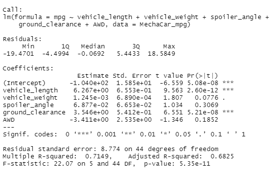

# MechaCar_Statistical_Analysis

## Linear Regression to Predict MPG

#### MPG = (6.267)vehicle_length + (0.001)vehicle_weight + (0.069)spoiler_angle + (3.546)ground_clearance + (-3.411)AWD + (-104.000)

#### Summary
* The **vehicle length** and **ground clearance** variables provided a non-random amount of variance to the mpg values in the dataset, meaning they have a significant impact on miles per gallon on the MechaCar prototype.
* The p-value of the linear regression analysis is 5.35e-11 which much smaller than our assumed significance level of 0.05%. Therefore the slope does not equal zero and there is sufficient evidence to **reject the null hypothesis**.
* **This linear model predicts the mpg of MechaCar prototypes effectively** because the R-squared value is  0.7149, meaning 71.49% of mpg predictions can be determined by this model.
