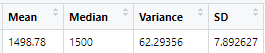

# MechaCar_Statistical_Analysis

## Linear Regression to Predict MPG

#### MPG = (6.267)vehicle_length + (0.001)vehicle_weight + (0.069)spoiler_angle + (3.546)ground_clearance + (-3.411)AWD + (-104.000)

#### Summary
* The **vehicle length** and **ground clearance** variables provided a non-random amount of variance to the mpg values in the dataset, meaning they have a significant impact on miles per gallon on the MechaCar prototype.
* The p-value of the linear regression analysis is 5.35e-11 which much smaller than our assumed significance level of 0.05%. Therefore the slope does not equal zero and there is sufficient evidence to **reject the null hypothesis**.
* **This linear model predicts the mpg of MechaCar prototypes effectively** because the R-squared value is  0.7149, meaning 71.49% of mpg predictions can be determined by this model.

## Summary Statistics on Suspension Coils

The design specifications for the MechaCar suspension coils dictate that the **variance of the suspension coils must not exceed 100 pounds per square inch (PSI)**.

The current **manufacturing data meet this design specification for all manufacturing lots in total**. The total variance is 62.29356 PSI, below the 100 PSI limit.

However, **the manufacturing data does not meet this design specification for each lot individually**. The suspension coil variance in Lot 3 is 170.2861224 PSI, which exceeds the 100 PSI limit.

The box plot below illustrates the PSI variance for each lot:

## T-Tests on Suspension Coils

#### All Manufacturing Lots:

The mean of all manufacturing lots is 1498.78, and the p-value is 0.06028. The p-value is above the common significance level of 0.05, so we accept the null hypothesis. This means the sample mean PSI of all lots is statistically similar to the total population mean.

#### Individual Manufacturing Lots:

* Lot 1 has a true sample mean of 1500 and a p-value of 1, so we accept the null hypothesis.
* Lot 2 has a mean of 1500.2 and a p-value of 0.6072, so we accept the null hypothesis.
* Lot 3 has a mean of 1496.14 and a p-value of 0.04168, so we reject the null hypothesis, meaning the mean PSI in Lot 3 is statistically different than the mean PSI of the general population. 

